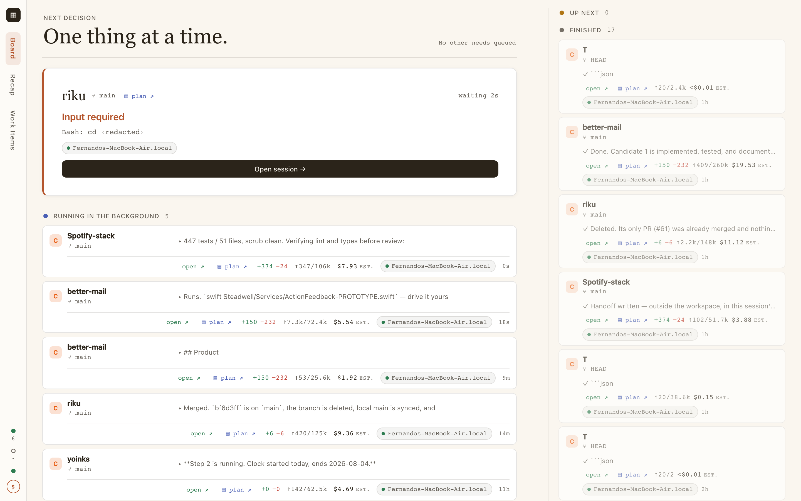
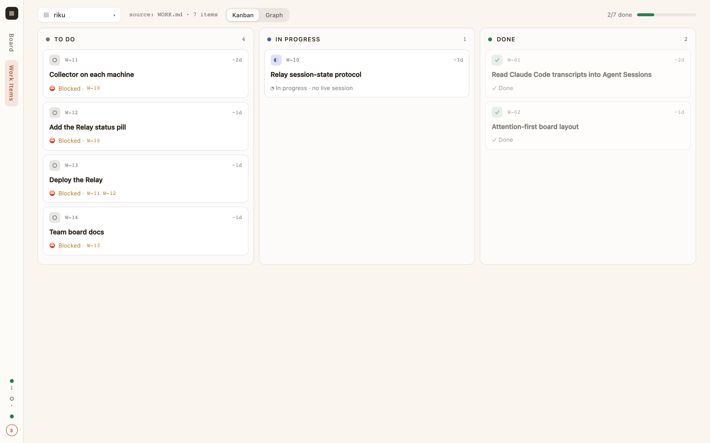
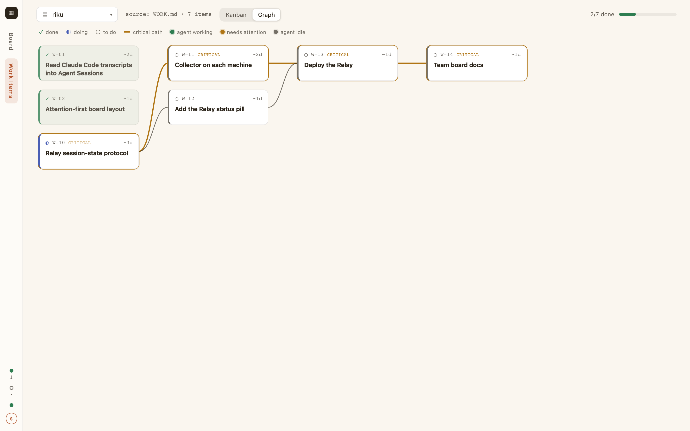

# Riku — Agent Board

Riku is a local, read-only mission-control board for Claude Code and Codex CLI
sessions. It puts the sessions that need your attention first, so you can see what
to respond to instead of searching through terminal windows.



## At a glance

- **Attention first.** Sessions needing a human appear before active and finished
  work; staleness stays a card hint rather than becoming an alert.
- **Local and read-only.** Riku reads local transcripts. A session can be resumed
  in a local Terminal window, but Riku never sends commands to an agent remotely.
- **Context with the work.** Cards show the model, branch, tokens, live git diff,
  and an optional cost estimate. The Work Items view connects a live session to the
  work it is carrying out.

## Install on macOS (Apple Silicon)

```sh
brew tap fskroes/riku
brew install riku
riku
```

Then open <http://localhost:4242>. Riku scans the default Claude Code and Codex CLI
session locations, so a solo board needs no configuration. You should see your
recent sessions arranged with Attention first.

Apple-Silicon binaries are published through Homebrew. On an Intel Mac, use the
[source build](#build-from-source) below.

## Common setups

### Solo board

Run `riku` and leave it running while you work. To use non-default transcript
locations, pass `--root <dir>` for Claude Code or `--codex-root <dir>` for Codex
CLI. `riku --help` lists the remaining board options.

### Team or multi-machine board

For sessions on other machines, run one **Relay** behind a TLS-terminating reverse
proxy, a **Collector** on each machine, and point the Board at the Relay. The Relay
only carries session state; it never carries agent-control commands.

```sh
# On the Relay host, behind a TLS proxy that forwards to 127.0.0.1:4343.
riku relay --addr 127.0.0.1:4343 --token "$RELAY_TOKEN"

# On each machine whose sessions you want to collect.
riku collect --relay https://relay.example.com --token "$RELAY_TOKEN"

# On the machine running the Board.
riku --relay https://relay.example.com --token "$RELAY_TOKEN"
```

Remote Relay URLs must use `https://`; plain HTTP is accepted only for a loopback
host such as `http://localhost:4343`. For the proxy configuration, certificate
requirements, and token handling, see [Deploying a multi-machine Relay](docs/relay-deployment.md).

You can save Relay and path settings in `~/.config/riku/config.toml`:

```sh
riku config set relay.url https://relay.example.com
riku config set relay.token "$RELAY_TOKEN"
```

Explicit flags take precedence over `RELAY_URL`, `RELAY_TOKEN`, `RIKU_ROOT`, and
`RIKU_CODEX_ROOT`, which in turn take precedence over the config file.

## Work Items

The **Work Items** view shows one project's work as a kanban and dependency graph.
It uses `WORK.md` when present; otherwise it reads GitHub Issues through `gh`.



`WORK.md` is a Markdown checklist. Use `- [ ]` for To do, `- [~]`, `- [-]`, or
`- [/]` for In progress, and `- [x]` for Done. The first token is the stable item
id; optional `(~2d)` and `(blocked by: W-12, W-13)` annotations add effort and
dependencies.

```md
- [ ] W-12 Add the Relay status pill (~1d)
- [ ] W-13 Deploy the Relay (blocked by: W-12)
```

When a same-project session is on a branch containing an item's id — for example,
`fix/W-12-relay-pill` — Riku displays the most recently active matching session as
that item's **Work Link**. This association is inferred from the current branch
name only: it is not stored or manually editable.



## Build from source

From the repository root, install the frontend dependencies and build the embedded
UI before compiling Riku:

```sh
cd web && npm ci && npm run build && cd ..
cargo run -p riku
```

The board runs at <http://localhost:4242>. `web/dist` must exist at compile time;
the build fails with this same command when it is missing.

For UI development with hot reload, run the API and Vite separately:

```sh
cargo run -p riku             # API on :4242
cd web && npm run dev         # UI on :5173, proxies /api to :4242
```

## Verify a checkout

```sh
cargo test
cd web && npm run build
```

## How it works

Each transcript becomes an **Agent Session** through one of two **Session Sources**:
Claude Code or Codex CLI. The Board watches local sessions directly; a Collector
watches a remote machine and pushes the same session state to a Relay. The board
merges those local and remote updates into one attention-first stream.

The board exposes a snapshot at `GET /api/sessions` and live updates through
Server-Sent Events at `GET /api/events`. See [CONTEXT.md](CONTEXT.md) for the project's
domain language and [the architecture decisions](docs/adr/) for the rationale
behind local-first operation, the read-only Relay, Explainable Attention, card
stats, and distribution.
